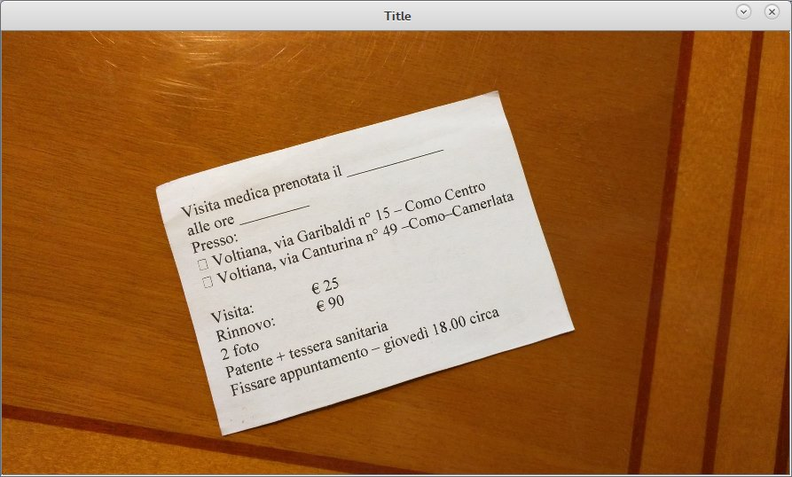
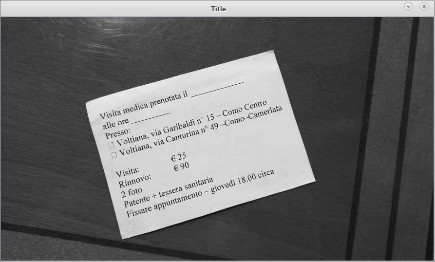
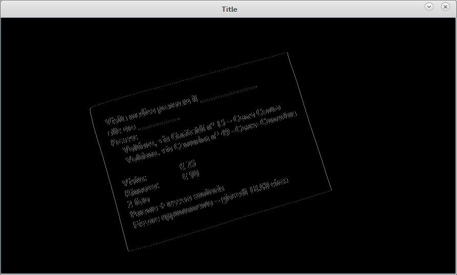
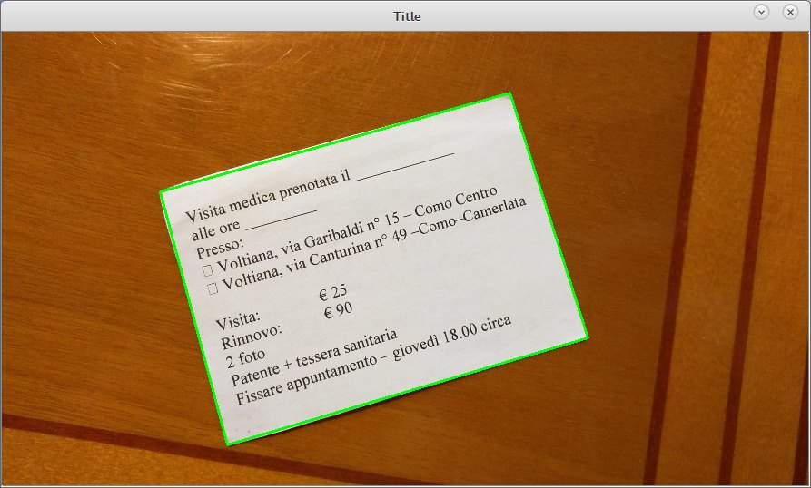
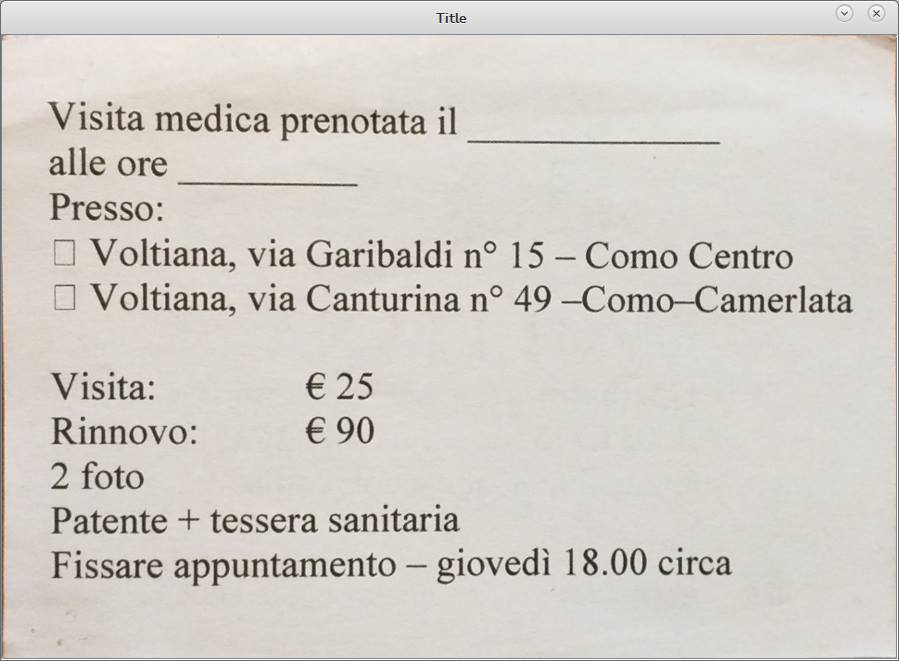
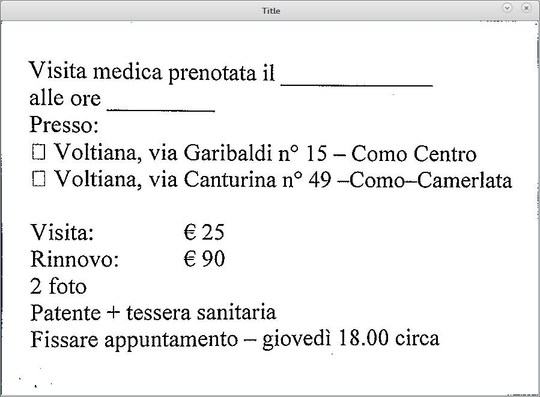

## Receiptscanner
A scanner of receipts using computer vision

This project implements a scanner of receipts. The ideal scenario is a picture of a receipt taken with a smartphone: the alghoritm identifies the receipt, removes all the unnecessary background, sharpens the text (="photocopy effect") and deskews the receipt to make it as close as possible to a rectangle.

More in detail, it works by:
- resizes the image to a target size (height 500 px, width proportional to image ratio)
- put the image in grayscale
- blurs the image (to smoothen and ease the work of the cannty edge detector)
- applies a canny edge filter and identifies all the ractangles in the images
- extracts the edges of the biggest rectangles among the ones identified (the assumption being, the receipt is in focus and therefore the main rectangle in the picture)
- scales the vertiecs of rectangle found to the size of the original image (not the resized one)
- extracts the rectangle from the original image
- deskews the rectangle to straighten it
- converts the deskwed image to grey colors and sharpens the image with an adaptive threshold to mimic a black and white photocopy effect

##Steps

1- Original image

2- Gray scale conversion on resized buffer image 

3- Blur to smoothen canny edge detector and remove artifacts  

4- Canny edge to identify the lines enclosing convex polygons.
We are interested in those with 4 sides (rectangles)

5- Find contours, with canny edge it's easy to identify the
largest 4 sides polygon in the image

6- Deskew (rotation and perspective adjustement) 

7- Black and white and threshold, to emulate a "photocopy effect"
that enhances text readability

8- (Optional) using an ocr such us tesseract on the output
you can get a very good text back.

`$ tesseract -l ita /tmp/output.png out`
